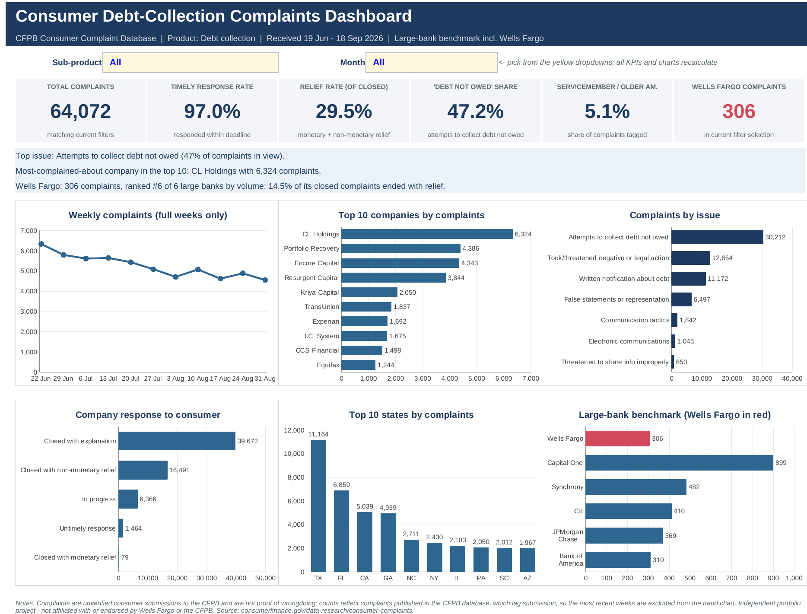

# Consumer Debt-Collection Complaints Dashboard (Excel)

An interactive Excel dashboard analysing **64,072 CFPB debt-collection complaints** (19 Jun - 18 Sep 2026), with a benchmark of **Wells Fargo against five other large banks**.

## Business questions
1. What are consumers complaining about most in debt collection, and where?
2. Are companies responding on time, and how often do complaints end with relief?
3. How does Wells Fargo compare with other large banks in this product area?

## Key findings (full data set)
- **47% of complaints (30,212)** are about *attempts to collect debt not owed*; the top three issues account for 84% of all complaints.
- **97.0%** of complaints received a timely company response, but only **29.5% of closed complaints** ended with monetary or non-monetary relief (monetary relief alone: 79 complaints).
- Volume is concentrated: **Texas (11,164) and Florida (6,859)** lead all states; the ten largest companies are mostly debt buyers and collectors (CL Holdings, Portfolio Recovery, Encore Capital) plus the three credit bureaus.
- **Wells Fargo: 306 complaints**, the lowest volume of the six large banks compared (Capital One 899, Synchrony 482, Citi 410, JPMorgan Chase 369, Bank of America 310). 14.5% of its closed complaints ended with relief, versus 62.8% at Citi and 2.9% at Bank of America.
- Weekly complaint volume trended down from ~6,300 (week of 22 Jun) to ~4,600 (week of 31 Aug).

## How the workbook is built
| Sheet | Purpose |
|---|---|
| **Dashboard** | Two dropdown filters (Sub-product, Month), 6 KPI cards, 3 auto-updating insight sentences, 6 charts |
| **Analysis** | 95 `COUNTIFS`-based formulas that feed every KPI and chart (no hard-coded results) |
| **Data** | Cleaned data as an Excel Table (`tblComplaints`), one row per complaint |
| **About** | Source, cleaning steps, metric definitions, caveats |

Excel skills shown: Excel Tables, `COUNTIFS`/`INDEX`/`MATCH`/`RANK`/`TEXT`, wildcard criteria driven by dropdown data validation, native charts, conditional insight text, professional formatting.

## Data source and license
CFPB Consumer Complaint Database - https://www.consumerfinance.gov/data-research/consumer-complaints/ (US federal government open data). Extract: Product = Debt collection, received 2026-06-19 to 2026-09-18, exported 2026-09-19. The raw CSV is not committed; download it from the link above.

## Cleaning steps
- Kept 14 of 15 columns (dropped ZIP code); parsed dates; added `Week start` and `Month` helper columns.
- Recoded sub-product "I do not know" to "Not specified"; blank Tags to "None"; blank State to "Unknown".
- Checked for duplicate Complaint IDs (none).

## Definitions and caveats
- **Timely response rate** = complaints with "Timely response? = Yes" / all complaints.
- **Relief rate** = closed with monetary or non-monetary relief / closed complaints (explanation + relief; excludes "In progress" and "Untimely response").
- Complaints appear in the public database after the company responds (or after 15 days), so the most recent weeks are under-counted; the trend chart shows full weeks 22 Jun - 6 Sep only.
- Complaints are unverified consumer allegations, not findings of wrongdoing, and counts are not normalised by customer base, so larger firms naturally receive more complaints.
- This is an independent portfolio project, not affiliated with or endorsed by Wells Fargo & Company or the CFPB.

## Validation
All KPIs, company, state, bank and weekly figures were cross-checked against an independent pandas calculation, both unfiltered and with filters applied (Sub-product = Credit card debt, Month = Aug 2026): every value matched. The workbook recalculates with zero formula errors.

